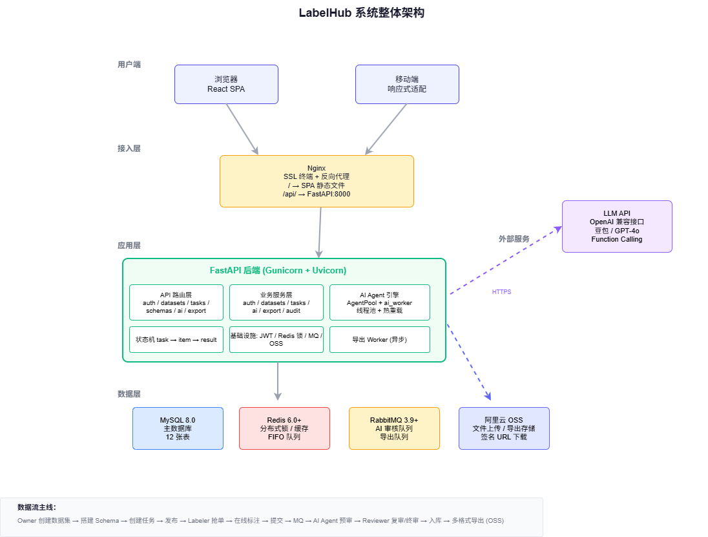
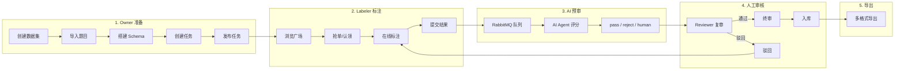
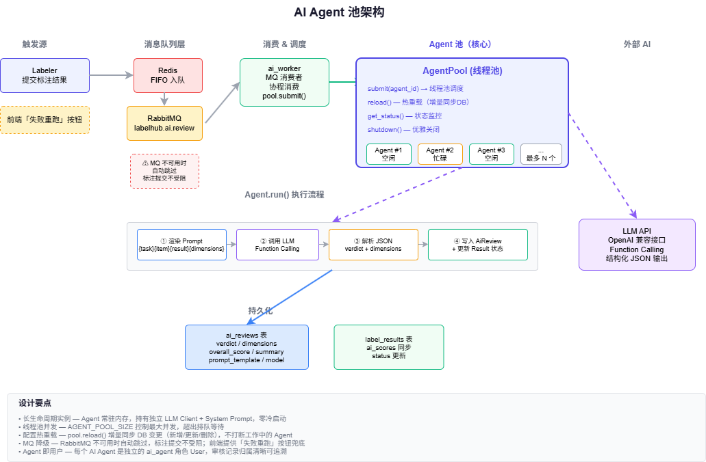
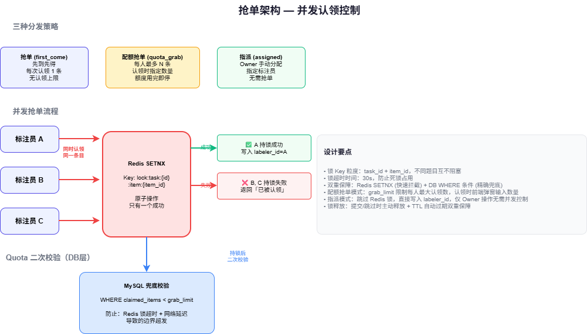
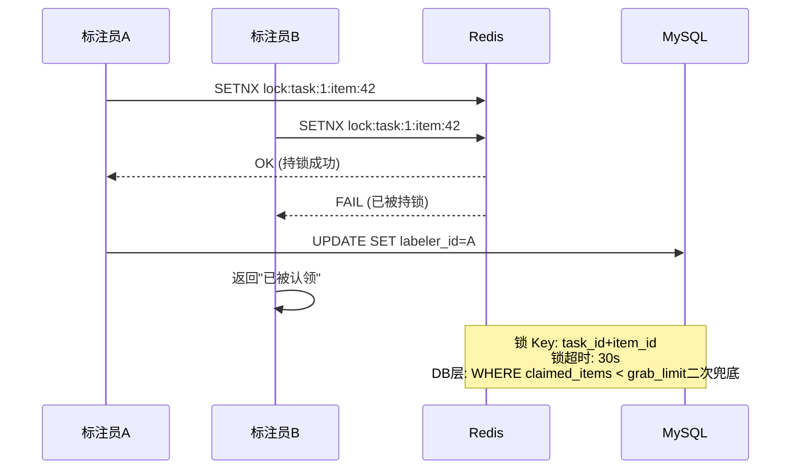
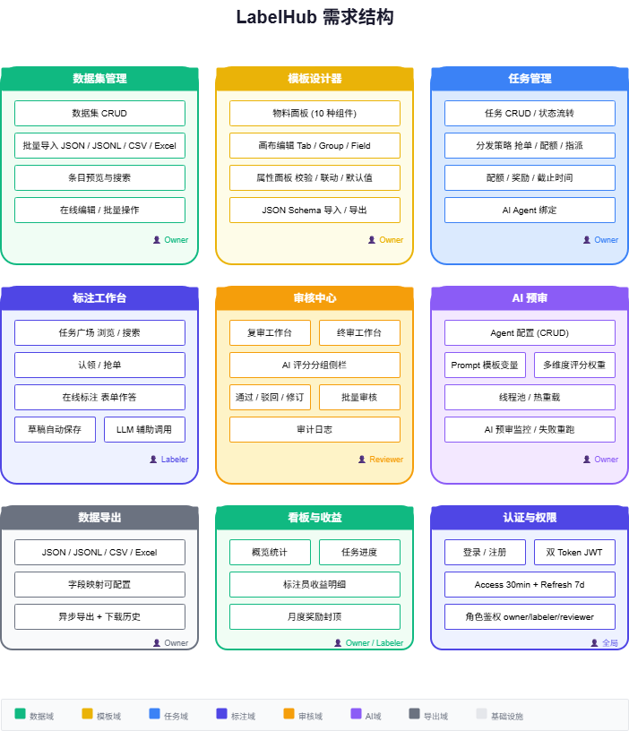
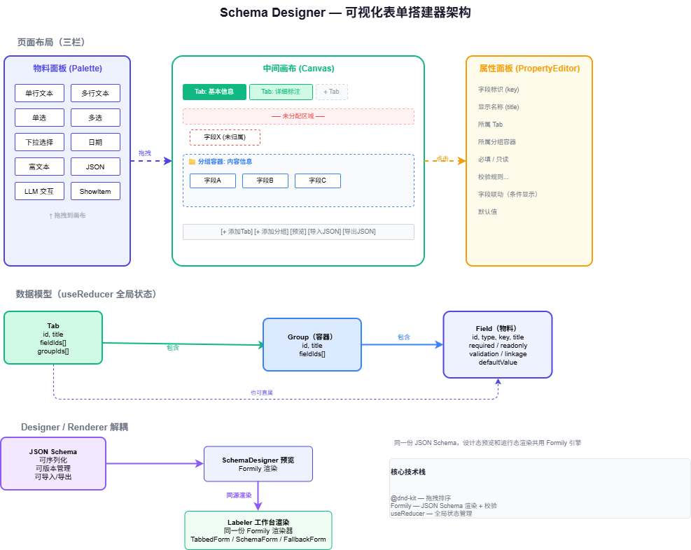
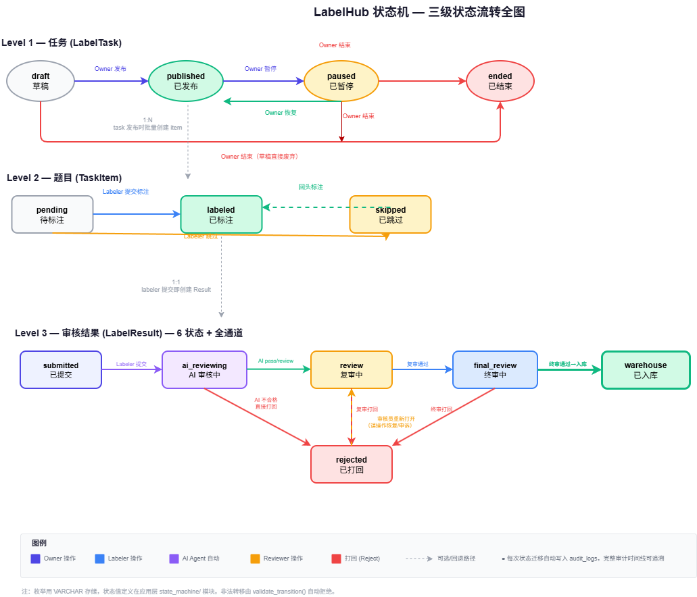
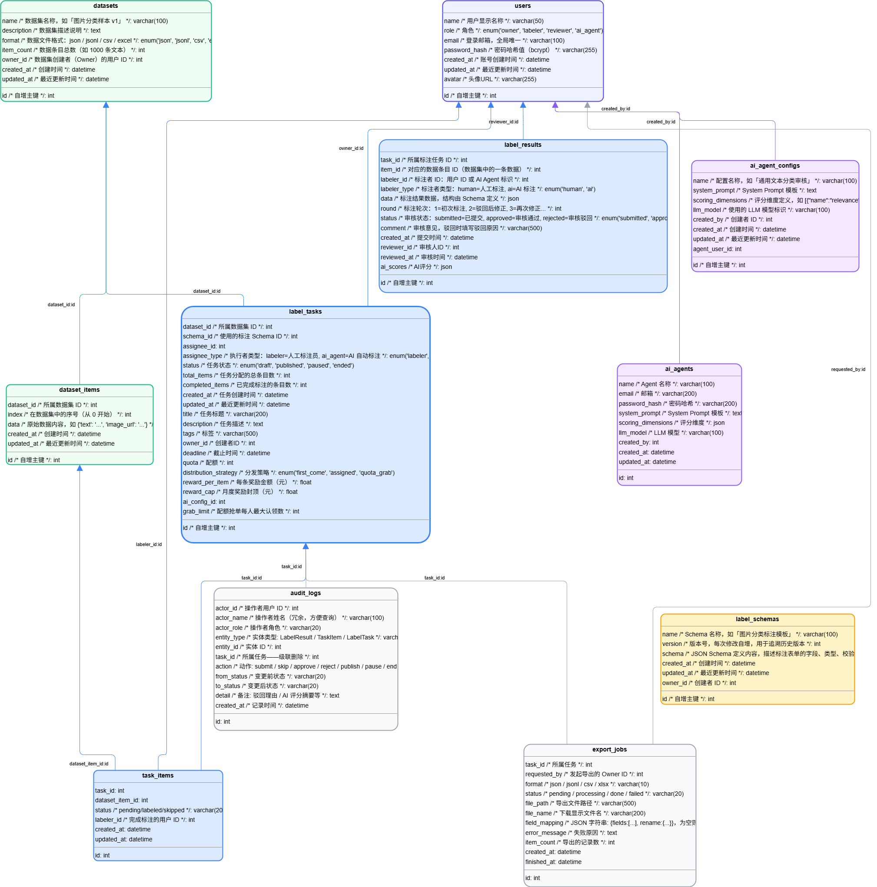
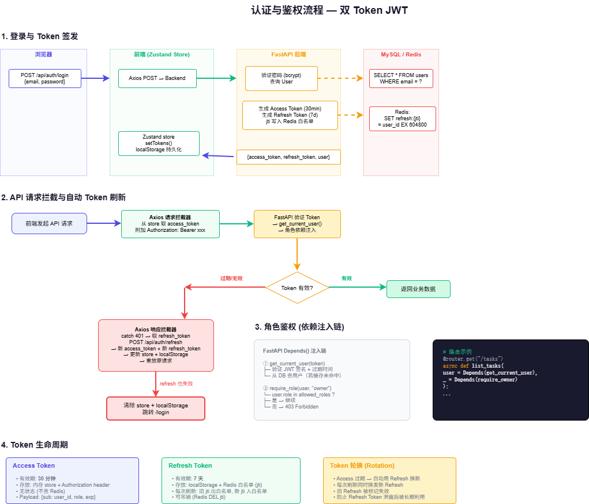

# LabelHub — AI 数据标注平台

覆盖「数据生产 → AI 预审 → 人工审核 → 多格式导出」全生命周期的 Web 数据标注平台。

## 目录

- [1. 架构说明](#1-架构说明)
  - [1.1 系统整体架构](#11-系统整体架构)
  - [1.2 Agent 池架构](#12-agent-池架构)
  - [1.3 抢单架构](#13-抢单架构)
  - [1.4 前端 Schema 搭建](#14-前端-schema-搭建)
- [2. 模块划分](#2-模块划分)
  - [2.1 功能模块](#21-功能模块)
  - [2.2 后端代码模块](#22-后端代码模块)
  - [2.3 前端代码模块](#23-前端代码模块)
- [3. 本地启动指引](#3-本地启动指引)
  - [3.1 环境要求](#31-环境要求)
  - [3.2 环境变量配置](#32-环境变量配置)
  - [3.3 启动后端](#33-启动后端)
  - [3.4 启动前端](#34-启动前端)
  - [3.5 运行测试](#35-运行测试)
  - [3.6 部署](#36-部署)
- [4. 关键设计取舍](#4-关键设计取舍)

---

## 1. 架构说明

### 1.1 系统整体架构



> 架构图说明：自上而下为用户端 → Nginx 反向代理 → FastAPI 后端服务 → 数据/缓存/消息队列层 → 外部 LLM API。前端为 React SPA 单页应用，后端为 Python FastAPI 单体服务，中间件层处理 JWT 鉴权与 CORS。

| 层级 | 技术 | 说明 |
|------|------|------|
| 用户入口 | React 19 + Ant Design 6 | SPA 单页应用，Vite 构建，Nginx 静态托管 |
| 反向代理 | Nginx + SSL | HTTPS 终端，`/api/` 代理至 FastAPI:8000 |
| 应用服务 | FastAPI + Gunicorn | 异步 ASGI，systemd 守护，2 worker |
| 关系数据库 | MySQL 8.0 | 用户 / 任务 / 提交 / 审核 / 数据集 / Schema |
| 缓存 & 锁 | Redis 6.0+ | 分布式锁（抢单）、FIFO 队列、Token 缓存 |
| 消息队列 | RabbitMQ 3.9+ | AI 审核队列 + 导出队列，异步解耦 |
| 对象存储 | 阿里云 OSS | 数据集文件上传 / 导出文件存储 / 签名下载 |
| AI 推理 | OpenAI 兼容 API | 豆包 / GPT-4o 等，Function Calling 结构化输出 |

**数据流主线**：



### 1.2 Agent 池架构



> 架构图说明：RabbitMQ 消费侧 → ai_worker → AgentPool.submit() → 线程池并发执行 Agent.run()。每个 Agent 为长生命周期实例，持有独立 LLM Client 与 System Prompt，池支持热重载。

**设计要点**：

- **长生命周期实例** — Agent 常驻内存，启动时加载 System Prompt + 评分维度，零冷启动
- **线程池并发** — `AGENT_POOL_SIZE` 控制最大并发数，超出排队等待
- **配置热重载** — `pool.reload()` 增量同步 DB 变更（新增 / 更新 / 删除），不打断工作中的 Agent
- **Agent 即用户** — 每个 AI Agent 是独立的 `ai_agent` 角色 User，审核记录归属清晰可追溯
- **MQ 降级** — RabbitMQ 不可用时自动跳过，标注提交不受阻；前端提供「失败重跑」按钮兜底

**Agent 执行流程**：

```
Labeler 提交结果
  → Redis 入队 (FIFO)
  → RabbitMQ "labelhub.ai.review"
  → ai_worker 消费
  → AgentPool.submit(agent_id)
  → Agent.run()
       ├── 渲染 Prompt 模板 ({task} {item} {result} {dimensions})
       ├── 调用 LLM (OpenAI 兼容 API + Function Calling)
       ├── 解析结构化评分 JSON
       ├── 写入 AiReview 表 (verdict / dimensions / summary / overall_score)
       └── 更新 LabelResult.status (ai_reviewing → review)
```

### 1.3 抢单架构



> 架构图说明：多 Labeler 并发认领同一任务时，Redis SETNX 分布式锁保证 quota 不超发。先到先得策略下每条 item 仅分配给第一个持锁者。

**分发策略**：

| 策略 | 标识 | 行为 |
|------|------|------|
| 抢单 | `first_come` | 先到先得，每次认领 1 条，无认领上限 |
| 配额抢单 | `quota_grab` | 每人最多认领 N 条（`grab_limit`），认领时指定数量 |
| 指派 | `assigned` | Owner 手动分配任务给指定标注员 |

**并发控制**（Redis SETNX）：



### 1.4 需求结构



### 1.5 前端 Schema 搭建



> 架构图说明：三栏布局 — 左侧物料面板 (Palette)、中间画布 (Canvas)、右侧属性面板 (PropertyEditor)。数据模型三层嵌套：Tab → Group → Field，全部通过 useReducer 管理。

**三层数据模型**：

```
Tab（标签页）
  ├── Field（字段）
  ├── Group（分组容器）
  │     ├── Field
  │     └── Field
  └── Field
```

- **Tab** — 多标签页组织表单，每个 Tab 可含字段 + 分组容器
- **Group** — 字段分组框（可折叠），嵌套在 Tab 内，字段继承容器的 Tab
- **Field** — 10 种物料组件（单行 / 多行 / 单选 / 多选 / 下拉 / 日期 / 富文本 / JSON / LLM 交互 / ShowItem）

**Designer / Renderer 解耦**：搭建产物为可序列化的 JSON Schema，SchemaDesigner 预览和 Labeler 工作台渲染共用同一套 Formily 渲染器。

**交互**：@dnd-kit 拖拽排序、Tab 双击重命名、分组容器内排序、属性面板配置校验规则与字段联动。

### 1.6 状态机流转



> 三级状态机：Task（4态）→ Item（3态）→ Result（6态审核流转）。每次状态迁移通过 `validate_transition()` 校验，非法转移自动拒绝，并写入 `audit_logs` 审计日志。

### 1.7 数据库 ER 图



> 12 张核心表，以 `tasks` 为枢纽关联数据集、Schema、AI Agent、标注结果与审核记录。

### 1.8 认证与鉴权



> 双 Token JWT：Access（30min，无状态）+ Refresh（7d，Redis jti 白名单可吊销）。Axios 拦截器自动刷新，FastAPI Depends() 注入链做角色鉴权。

---

## 2. 模块划分

### 2.1 功能模块

| 模块 | 使用者 | 核心功能 |
|------|--------|---------|
| 数据集管理 | Owner | 创建数据集、JSON/JSONL/CSV/Excel 批量导入、条目预览与编辑 |
| Schema 设计器 | Owner | 拖拽搭建标注表单模板、配置校验规则与字段联动、JSON Schema 导入/导出 |
| 任务管理 | Owner | 创建任务（绑定数据集+Schema+AI Agent）、配置分发策略/配额/奖励/截止时间、发布/暂停/结束 |
| 标注工作台 | Labeler | 任务广场浏览、认领/抢单、在线标注、草稿自动保存、提交/跳过 |
| 审核中心 | Reviewer | 复审/终审双视角、AI 评分分组侧栏、对比视图、通过/驳回/修订 |
| AI 预审监控 | Owner | AI 审核队列、维度评分条形图、Prompt 模板查看、失败重跑 |
| AI Agent 配置 | Owner | Agent CRUD、System Prompt 模板、评分维度与权重、池状态监控 |
| 数据导出 | Owner | JSON/JSONL/CSV/Excel 异步导出、字段映射、下载历史 |
| 数据看板 | Owner | 概览统计、任务进度、数据集统计 |
| 标注收益 | Labeler | 我的收益、奖励明细 |

### 2.2 后端代码模块

```
backend/app/
├── api/v1/           # API 路由层 — 参数校验 + 依赖注入 + 返回序列化
│   ├── auth/         # 认证 (register / login / refresh / me / users)
│   ├── datasets/     # 数据集 + 条目管理
│   ├── schemas/      # Schema CRUD (含版本管理)
│   ├── tasks/        # 任务生命周期 (领单 / 提交 / 审核 / 导出 / 审计)
│   ├── ai/           # AI Agent 管理 + AI 审核查询 / 重跑
│   └── common/       # 看板 / 文件上传 / LLM 触发
├── services/         # 业务逻辑层 — 事务管理 + 跨模型编排
├── models/           # SQLAlchemy ORM 模型 (12 张表)
├── schemas/          # Pydantic 请求/响应 DTO
├── agents/           # AI Agent 引擎 (agent / pool / worker)
├── state_machine/    # 通用状态机 (task → item → result 三级)
├── infra/            # 基础设施 (JWT / Redis / MQ / 中间件 / 异常)
├── config/           # 配置 (pydantic-settings + DB engine)
├── export/           # 异步导出 worker
└── scripts/          # 种子数据 / 状态机测试 / 打包脚本
```

### 2.3 前端代码模块

```
frontend/src/
├── pages/            # 页面模块 (13 个独立路由)
│   ├── SchemaDesigner/   # Schema 设计器 — index + 3 panels + 2 components + 2 utils
│   ├── Labeling/         # 标注工作台 — 大厅 + 工作区 + 4 components
│   ├── Review/           # 审核中心 — 列表 + 2 components
│   ├── AiReview/         # AI 预审监控 — 任务队列 + 5 components
│   └── ...               # Login / Datasets / TaskManage / AiConfigs / Dashboard / Earnings / ExportHistory / Home / Tutorial
├── api/              # API 客户端 (Axios 单例 + 自动 Token 刷新)
├── components/       # 布局组件 (AppLayout / WorkspaceLayout / TopHeader / ProtectedRoute / RoleRoute)
├── store/            # Zustand 全局状态 (user / tokens / authReady)
├── types/models/     # 集中类型管理 (interface / type / constant，零 any)
└── hooks/            # 公共 Hooks
```

---

## 3. 本地启动指引

### 3.1 环境要求

| 依赖 | 版本 | 用途 |
|------|------|------|
| Node.js | ≥ 20 | 前端构建与开发 |
| Python | ≥ 3.12 | 后端运行 |
| MySQL | 8.0+ | 主数据库 |
| Redis | 6.0+ | 分布式锁 / 缓存 / 队列 |
| RabbitMQ | 3.9+ | AI 审核 + 导出异步队列 |

### 3.2 环境变量配置

```bash
cp .env.example .env
```

编辑 `.env` 填写以下必填项：

```ini
# ── 数据库 ──
DB_HOST=localhost
DB_PORT=3306
DB_USER=root
DB_PASSWORD=your_password
DB_NAME=labelhub

# ── Redis ──
REDIS_HOST=localhost
REDIS_PORT=6379
REDIS_PASSWORD=
REDIS_DB=0

# ── RabbitMQ ──
MQ_HOST=localhost
MQ_PORT=5672
MQ_USER=guest
MQ_PASSWORD=guest
MQ_VHOST=/

# ── LLM ──
LLM_API_KEY=your_api_key
LLM_BASE_URL=https://api.openai.com/v1
LLM_MODEL=gpt-4o
AGENT_POOL_SIZE=5

# ── JWT ──
JWT_SECRET=your_jwt_secret_key
```

### 3.3 启动后端

```bash
# 1. 创建数据库
mysql -u root -p -e "CREATE DATABASE IF NOT EXISTS labelhub DEFAULT CHARACTER SET utf8mb4 COLLATE utf8mb4_unicode_ci;"

# 2. 安装依赖
cd backend
pip install -r requirements.txt

# 3. 一键启动
python run.py
```

`run.py` 自动启动：uvicorn (0.0.0.0:8000) + 导出 worker + AI worker。启动时自动建表，无需手动 migration。

API 文档：http://localhost:8000/docs

### 3.4 启动前端

```bash
cd frontend
npm install
npm run dev
```

访问 http://localhost:5173

### 3.5 运行测试

```bash
cd backend
pytest -v
```

### 3.6 部署

生产环境部署：

```bash
# 后端
bash scripts/deploy-backend.sh   # systemd + gunicorn, 目标 /opt/labelhub/backend

# 前端
bash scripts/deploy-frontend.sh  # Vite 构建 + Nginx 静态托管 + SSL
```

部署要求服务器安装 Docker（Nginx 容器）并配置 SSL 证书。详细见 `scripts/` 目录下的脚本注释。

**数据库迁移**：本项目使用 SQLAlchemy `create_all` 自动建表，不依赖 Alembic migration。若需手动迁移，`backend/app/scripts/` 下提供种子数据脚本。

---

## 4. 关键设计取舍

| 决策点 | 选择 | 放弃 | 理由 |
|--------|------|------|------|
| 任务队列 | RabbitMQ 直连 | Celery | 单机部署、Agent < 10，Celery 过度设计且运维负担重 |
| Agent 架构 | 线程池 + 长生命周期实例 | 无状态 Task / 每次新建 Client | 零冷启动、状态可观测、配置热重载 |
| AI 审核记录 | 独立 `ai_reviews` 表 | 塞入 `label_results` | 关注点分离、重跑历史可追溯、聚合查询方便 |
| 状态存储 | VARCHAR | ENUM | 保留 DDL 变更灵活性，枚举逻辑上浮到应用层 |
| 表单方案 | Formily JSON Schema 驱动 | 手写表单组件 | Designer / Renderer 天然解耦，Schema 可序列化可版本化 |
| 认证方案 | 双 Token JWT (Access + Refresh) | Session / OAuth | 无状态 Access 高性能，jti 白名单 Refresh 可吊销 |
| 并发领单 | Redis SETNX 分布式锁 | DB 悲观锁 (SELECT FOR UPDATE) | 粒度更细（item 级），比 DB 锁更轻量 |
| 前端类型 | TypeScript strict + 集中管理 | 宽松类型 / 内联 interface | 零 `any`，所有类型定义在 `types/models/` 统一维护 |
| 前端状态 | Zustand | Redux / Context | API 量小，Zustand 无 boilerplate，按需订阅避免重渲染 |
| API 风格 | 单版本 `/api/v1/` | 多版本并存 | 项目规模不大，单版本足够，过度版本化增加维护成本 |
| 数据库迁移 | `create_all` 自动建表 | Alembic | 开发阶段快速迭代，生产环境手动 SQL 迁移 |
| Schema 设计器 | 三层（Tab → Group → Field） | 平铺字段列表 | 三层模型覆盖复杂表单场景（多页签 + 字段分组） |
| AI 调用协议 | Function Calling 结构化输出 | 自由文本 + 正则解析 | 评分维度多、需要结构化 verdict + dimensions，JSON 模式更可靠 |
| 文件存储 | 阿里云 OSS | 本地磁盘 | 导出文件需公网下载，OSS 签名 URL 免鉴权 |

---

## 技术栈

前端: React 19 · TypeScript 6 · Vite 8 · Ant Design 6 · Formily · @dnd-kit · Zustand · ECharts

后端: Python 3.12+ · FastAPI · SQLAlchemy 2.0 · Pydantic v2 · MySQL · Redis · RabbitMQ · OpenAI API

## 文档

| 文档 | 说明 |
|------|------|
| `docs/architecture.md` | 系统详细设计 |
| `docs/readme-*.drawio` | 架构图源文件（工作流 / 状态机 / Schema 设计器 / AI Agent） |
| `docs/prompt思路/` | 各阶段开发 Prompt 设计思路 |
| `docs/canvas/` | 功能截图 |

## License

MIT
