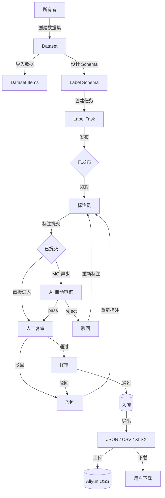
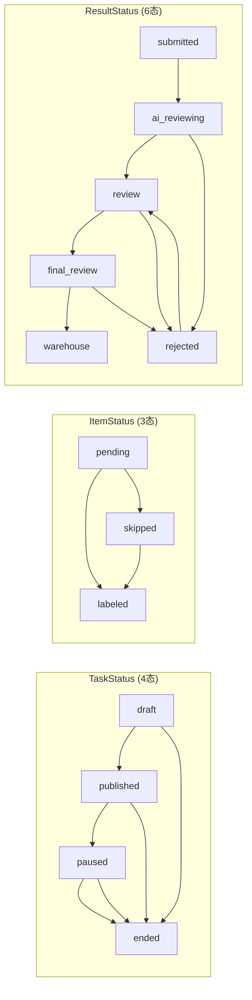
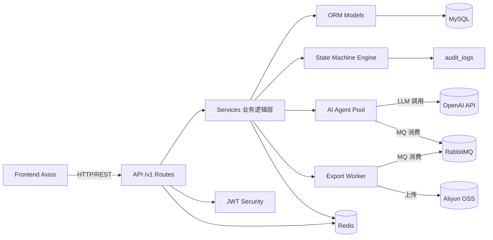

# 项目架构文档 — Hongc-LabelHub

## 整体架构

<svg xmlns="http://www.w3.org/2000/svg" viewBox="0 0 1200 980" width="100%" height="100%" style="background:#FAFAFA;font-family:-apple-system,BlinkMacSystemFont,'Segoe UI',Roboto,sans-serif"><defs><filter id="shadow" x="-4%" y="-4%" width="108%" height="116%"><feDropShadow dx="0" dy="2" stdDeviation="4" flood-color="#000" flood-opacity="0.08"/></filter><filter id="shadowDeep" x="-2%" y="-2%" width="104%" height="112%"><feDropShadow dx="0" dy="4" stdDeviation="8" flood-color="#000" flood-opacity="0.12"/></filter><marker id="arrowBlue" viewBox="0 0 10 10" refX="5" refY="10" markerWidth="8" markerHeight="8" orient="auto"><path d="M0,0 L5,10 L10,0" fill="#1677FF"/></marker><marker id="arrowGreen" viewBox="0 0 10 10" refX="5" refY="10" markerWidth="8" markerHeight="8" orient="auto"><path d="M0,0 L5,10 L10,0" fill="#52C41A"/></marker><linearGradient id="frontGrad" x1="0" y1="0" x2="1" y2="0"><stop offset="0%" stop-color="#1677FF"/><stop offset="100%" stop-color="#4096FF"/></linearGradient><linearGradient id="backGrad" x1="0" y1="0" x2="1" y2="0"><stop offset="0%" stop-color="#52C41A"/><stop offset="100%" stop-color="#73D13D"/></linearGradient><linearGradient id="infraGrad" x1="0" y1="0" x2="1" y2="0"><stop offset="0%" stop-color="#FA8C16"/><stop offset="100%" stop-color="#FFA940"/></linearGradient></defs><rect x="0" y="0" width="1200" height="980" fill="#FAFAFA"/><text x="600" y="28" text-anchor="middle" font-size="20" font-weight="700" fill="#262626">Hongc-LabelHub 系统架构图</text><!-- ═══════════ FRONTEND LAYER ═══════════ --><rect x="30" y="50" width="1140" height="250" fill="#F0F5FF" stroke="#ADCBFF" stroke-width="1.5" rx="6"/><rect x="30" y="50" width="1140" height="34" fill="url(#frontGrad)" rx="6"/><rect x="30" y="68" width="1140" height="16" fill="url(#frontGrad)"/><text x="50" y="72" font-size="15" font-weight="700" fill="#FFF">🖥️ 前端层 — Frontend Layer (React 19 + TypeScript + Vite)</text><text x="1150" y="72" text-anchor="end" font-size="12" fill="rgba(255,255,255,0.8)">用户浏览器</text><!-- F1: Pages & Routes --><rect x="50" y="100" width="250" height="85" fill="#FFF" stroke="#D9D9D9" stroke-width="1" filter="url(#shadow)"/><rect x="50" y="100" width="250" height="24" fill="#E6F4FF"/><text x="175" y="116" text-anchor="middle" font-size="12" font-weight="600" fill="#1677FF">Pages &amp; Routes</text><text x="60" y="140" font-size="10.5" fill="#595959">Home · Login · Register · Tutorial</text><text x="60" y="155" font-size="10.5" fill="#595959">Datasets · SchemaDesigner · TaskManage</text><text x="60" y="170" font-size="10.5" fill="#595959">Labeling · Review · AiReview · Dashboard</text><!-- F2: State --><rect x="330" y="100" width="210" height="85" fill="#FFF" stroke="#D9D9D9" stroke-width="1" filter="url(#shadow)"/><rect x="330" y="100" width="210" height="24" fill="#E6F4FF"/><text x="435" y="116" text-anchor="middle" font-size="12" font-weight="600" fill="#1677FF">State (Zustand 5)</text><text x="340" y="140" font-size="10.5" fill="#595959">useAppStore — 用户 + Token</text><text x="340" y="155" font-size="10.5" fill="#595959">tokenStore — localStorage</text><text x="340" y="170" font-size="10.5" fill="#595959">authReady → 自动初始化</text><!-- F3: API Client --><rect x="570" y="100" width="250" height="85" fill="#FFF" stroke="#D9D9D9" stroke-width="1" filter="url(#shadow)"/><rect x="570" y="100" width="250" height="24" fill="#E6F4FF"/><text x="695" y="116" text-anchor="middle" font-size="12" font-weight="600" fill="#1677FF">API Client (Axios)</text><text x="580" y="140" font-size="10.5" fill="#595959">client.ts — 拦截器 + Token 刷新</text><text x="580" y="155" font-size="10.5" fill="#595959">auth · datasets · schemas · tasks</text><text x="580" y="170" font-size="10.5" fill="#595959">dashboard · ai-agents · ai-configs</text><!-- F4: UI Libs --><rect x="850" y="100" width="290" height="85" fill="#FFF" stroke="#D9D9D9" stroke-width="1" filter="url(#shadow)"/><rect x="850" y="100" width="290" height="24" fill="#E6F4FF"/><text x="995" y="116" text-anchor="middle" font-size="12" font-weight="600" fill="#1677FF">UI Frameworks</text><text x="860" y="140" font-size="10.5" fill="#595959">Ant Design 6 — 组件库</text><text x="860" y="155" font-size="10.5" fill="#595959">@dnd-kit — 拖拽 (Schema Designer)</text><text x="860" y="170" font-size="10.5" fill="#595959">@formily — 表单渲染 + ECharts 6</text><!-- F5: Shared Components --><rect x="50" y="205" width="1090" height="75" fill="#FFF" stroke="#D9D9D9" stroke-width="1" filter="url(#shadow)"/><rect x="50" y="205" width="1090" height="24" fill="#F0F5FF"/><text x="595" y="221" text-anchor="middle" font-size="12" font-weight="600" fill="#1677FF">Shared Components / Layouts</text><text x="60" y="245" font-size="10.5" fill="#595959">AppLayout — 公共布局 (TopHeader + Outlet)</text><text x="60" y="260" font-size="10.5" fill="#595959">WorkspaceLayout — 工作台布局 (侧边栏 + TopHeader + Outlet) · ProtectedRoute · RoleRoute</text><text x="60" y="275" font-size="10.5" fill="#595959">SchemaDesigner (DndContext + useReducer) · StatusFlow · JsonEditor</text><!-- Arrow: Frontend → Backend --><line x1="600" y1="300" x2="600" y2="330" stroke="#1677FF" stroke-width="3" marker-end="url(#arrowBlue)"/><text x="610" y="320" font-size="11" fill="#1677FF" font-weight="600">HTTP/REST via Axios</text><!-- ═══════════ BACKEND LAYER ═══════════ --><rect x="30" y="340" width="1140" height="400" fill="#F6FFED" stroke="#B7EB8F" stroke-width="1.5" rx="6"/><rect x="30" y="340" width="1140" height="34" fill="url(#backGrad)" rx="6"/><rect x="30" y="358" width="1140" height="16" fill="url(#backGrad)"/><text x="50" y="362" font-size="15" font-weight="700" fill="#FFF">⚙️ 后端层 — Backend Layer (FastAPI + Python + SQLAlchemy 2.0)</text><text x="1150" y="362" text-anchor="end" font-size="12" fill="rgba(255,255,255,0.8)">服务器</text><!-- B1: API Routes --><rect x="50" y="390" width="1090" height="60" fill="#FFF" stroke="#D9D9D9" stroke-width="1" filter="url(#shadow)"/><rect x="50" y="390" width="1090" height="24" fill="#F6FFED"/><text x="595" y="406" text-anchor="middle" font-size="12" font-weight="600" fill="#52C41A">API /v1 Routes — 路由模块 (Prefix: /api)</text><text x="60" y="430" font-size="10.5" fill="#595959">auth — 注册/登录/刷新/用户</text><text x="260" y="430" font-size="10.5" fill="#595959">datasets — CRUD + Items + 批量导入</text><text x="500" y="430" font-size="10.5" fill="#595959">schemas — 标签 Schema CRUD</text><text x="720" y="430" font-size="10.5" fill="#595959">tasks — 任务 CRUD + Claim + 审核</text><text x="910" y="430" font-size="10.5" fill="#595959">ai — Agents + Configs + Reviews</text><text x="60" y="444" font-size="10.5" fill="#595959">common — Dashboard统计 / Upload上传 / LLM触发</text><!-- B2: Services --><rect x="50" y="468" width="250" height="95" fill="#FFF" stroke="#D9D9D9" stroke-width="1" filter="url(#shadow)"/><rect x="50" y="468" width="250" height="24" fill="#F6FFED"/><text x="175" y="484" text-anchor="middle" font-size="11" font-weight="600" fill="#52C41A">Services — 业务逻辑层</text><text x="60" y="506" font-size="10" fill="#595959">AuthService — JWT + bcrypt</text><text x="60" y="520" font-size="10" fill="#595959">DatasetService — 数据集隔离</text><text x="60" y="534" font-size="10" fill="#595959">TaskService — CRUD + Claim (Redis锁)</text><text x="60" y="548" font-size="10" fill="#595959">SchemaService / AiReviewService</text><text x="60" y="558" font-size="10" fill="#595959">AuditService / ExportService</text><!-- B3: State Machine --><rect x="330" y="468" width="220" height="95" fill="#FFF" stroke="#D9D9D9" stroke-width="1" filter="url(#shadow)"/><rect x="330" y="468" width="220" height="24" fill="#F6FFED"/><text x="440" y="484" text-anchor="middle" font-size="11" font-weight="600" fill="#52C41A">State Machine Engine</text><text x="340" y="506" font-size="10" fill="#595959">base.py — 全局注册表</text><text x="340" y="520" font-size="10" fill="#595959">  validate_transition()</text><text x="340" y="534" font-size="10" fill="#595959">  transit() + audit_log</text><text x="340" y="548" font-size="10" fill="#595959">TaskStatus (4态)</text><text x="340" y="558" font-size="10" fill="#595959">ItemStatus (3态) / ResultStatus (6态)</text><!-- B4: AI Agent --><rect x="580" y="468" width="250" height="95" fill="#FFF" stroke="#D9D9D9" stroke-width="1" filter="url(#shadow)"/><rect x="580" y="468" width="250" height="24" fill="#F6FFED"/><text x="705" y="484" text-anchor="middle" font-size="11" font-weight="600" fill="#52C41A">AI Agent System</text><text x="590" y="506" font-size="10" fill="#595959">Agent — LLM 调用 + 结构化解析</text><text x="590" y="520" font-size="10" fill="#595959">AgentPool — ThreadPoolExecutor</text><text x="590" y="534" font-size="10" fill="#595959">ai_worker — MQ 消费者</text><text x="590" y="548" font-size="10" fill="#595959">维度评分判决</text><text x="590" y="558" font-size="10" fill="#595959">pass / reject / human_review</text><!-- B5: Export --><rect x="860" y="468" width="280" height="95" fill="#FFF" stroke="#D9D9D9" stroke-width="1" filter="url(#shadow)"/><rect x="860" y="468" width="280" height="24" fill="#F6FFED"/><text x="1000" y="484" text-anchor="middle" font-size="11" font-weight="600" fill="#52C41A">Export Worker</text><text x="870" y="506" font-size="10" fill="#595959">MQ 消费者 — labelhub.export</text><text x="870" y="520" font-size="10" fill="#595959">格式: JSON / JSONL / CSV / XLSX</text><text x="870" y="534" font-size="10" fill="#595959">apply_mapping (Schema字段映射)</text><text x="870" y="548" font-size="10" fill="#595959">压缩上传到 OSS + 签名URL</text><text x="870" y="558" font-size="10" fill="#595959">ExportJob 状态跟踪</text><!-- B6: ORM Models --><rect x="50" y="582" width="1090" height="60" fill="#FFF" stroke="#D9D9D9" stroke-width="1" filter="url(#shadow)"/><rect x="50" y="582" width="1090" height="24" fill="#F6FFED"/><text x="595" y="598" text-anchor="middle" font-size="12" font-weight="600" fill="#52C41A">ORM Models (SQLAlchemy 2.0) — 11 张业务表</text><text x="60" y="624" font-size="10.5" fill="#595959">auth: User</text><text x="170" y="624" font-size="10.5" fill="#595959">datasets: Dataset · DatasetItem</text><text x="400" y="624" font-size="10.5" fill="#595959">schemas: LabelSchema</text><text x="570" y="624" font-size="10.5" fill="#595959">tasks: LabelTask · TaskItem · LabelResult</text><text x="830" y="624" font-size="10.5" fill="#595959">ai: AiAgent · AiReview</text><text x="60" y="636" font-size="10.5" fill="#595959">common: AuditLog · ExportJob</text><!-- B7: Infrastructure --><rect x="50" y="658" width="1090" height="62" fill="#FFF" stroke="#D9D9D9" stroke-width="1" filter="url(#shadow)"/><rect x="50" y="658" width="1090" height="24" fill="#F0F5FF"/><text x="595" y="674" text-anchor="middle" font-size="12" font-weight="600" fill="#595959">Infrastructure — 基础设施层</text><text x="60" y="698" font-size="10.5" fill="#595959">config/settings.py — pydantic-settings 配置中心</text><text x="450" y="698" font-size="10.5" fill="#595959">infra/security.py — JWT 双Token</text><text x="750" y="698" font-size="10.5" fill="#595959">infra/exceptions.py — 异常体系</text><text x="60" y="714" font-size="10.5" fill="#595959">infra/middleware.py — 日志 + 异常处理</text><text x="350" y="714" font-size="10.5" fill="#595959">infra/redis_client.py — 连接池/锁/队列</text><text x="650" y="714" font-size="10.5" fill="#595959">infra/mq_client.py — RabbitMQ 发布/消费</text><!-- Arrow: Backend → Infrastructure --><line x1="600" y1="740" x2="600" y2="770" stroke="#52C41A" stroke-width="3" marker-end="url(#arrowGreen)"/><text x="610" y="760" font-size="11" fill="#52C41A" font-weight="600">SQL / Redis / AMQP / S3 / HTTP</text><!-- ═══════════ INFRASTRUCTURE LAYER ═══════════ --><rect x="30" y="780" width="1140" height="175" fill="#FFF7E6" stroke="#FFD591" stroke-width="1.5" rx="6"/><rect x="30" y="780" width="1140" height="34" fill="url(#infraGrad)" rx="6"/><rect x="30" y="798" width="1140" height="16" fill="url(#infraGrad)"/><text x="50" y="802" font-size="15" font-weight="700" fill="#FFF">☁️ 基础设施层 — Infrastructure Layer</text><text x="1150" y="802" text-anchor="end" font-size="12" fill="rgba(255,255,255,0.8)">外部服务</text><!-- I1: MySQL --><rect x="50" y="830" width="196" height="105" fill="#FFF" stroke="#D9D9D9" stroke-width="1" filter="url(#shadowDeep)"/><rect x="50" y="830" width="196" height="28" fill="#FFF7E6"/><text x="98" y="849" font-size="12" font-weight="600" fill="#D4380D">MySQL 8.0</text><text x="62" y="878" font-size="10" fill="#595959">数据库引擎</text><text x="62" y="894" font-size="10" fill="#595959">所有业务数据持久化</text><text x="62" y="910" font-size="10" fill="#595959">PyMySQL 驱动</text><text x="62" y="926" font-size="10" fill="#595959">SQLAlchemy ORM 映射</text><!-- I2: Redis --><rect x="266" y="830" width="196" height="105" fill="#FFF" stroke="#D9D9D9" stroke-width="1" filter="url(#shadowDeep)"/><rect x="266" y="830" width="196" height="28" fill="#FFF7E6"/><text x="314" y="849" font-size="12" font-weight="600" fill="#D4380D">Redis 7.x</text><text x="278" y="878" font-size="10" fill="#595959">Refresh Token 白名单</text><text x="278" y="894" font-size="10" fill="#595959">Distributed Lock</text><text x="278" y="910" font-size="10" fill="#595959">RxQueue (MQ fallback)</text><text x="278" y="926" font-size="10" fill="#595959">Cache</text><!-- I3: RabbitMQ --><rect x="482" y="830" width="196" height="105" fill="#FFF" stroke="#D9D9D9" stroke-width="1" filter="url(#shadowDeep)"/><rect x="482" y="830" width="196" height="28" fill="#FFF7E6"/><text x="530" y="849" font-size="12" font-weight="600" fill="#D4380D">RabbitMQ</text><text x="494" y="878" font-size="10" fill="#595959">异步消息队列</text><text x="494" y="894" font-size="10" fill="#595959">labelhub.ai.review</text><text x="494" y="910" font-size="10" fill="#595959">labelhub.export</text><text x="494" y="926" font-size="10" fill="#595959">pika 客户端</text><!-- I4: Aliyun OSS --><rect x="698" y="830" width="196" height="105" fill="#FFF" stroke="#D9D9D9" stroke-width="1" filter="url(#shadowDeep)"/><rect x="698" y="830" width="196" height="28" fill="#FFF7E6"/><text x="746" y="849" font-size="12" font-weight="600" fill="#D4380D">Aliyun OSS</text><text x="710" y="878" font-size="10" fill="#595959">文件/图片存储</text><text x="710" y="894" font-size="10" fill="#595959">导出文件上传</text><text x="710" y="910" font-size="10" fill="#595959">oss2 SDK</text><text x="710" y="926" font-size="10" fill="#595959">签名下载 URL</text><!-- I5: OpenAI API --><rect x="914" y="830" width="226" height="105" fill="#FFF" stroke="#D9D9D9" stroke-width="1" filter="url(#shadowDeep)"/><rect x="914" y="830" width="226" height="28" fill="#FFF7E6"/><text x="962" y="849" font-size="12" font-weight="600" fill="#D4380D">OpenAI Compatible</text><text x="926" y="878" font-size="10" fill="#595959">LLM 推理 API</text><text x="926" y="894" font-size="10" fill="#595959">AI Agent 自动审核</text><text x="926" y="910" font-size="10" fill="#595959">字段值智能推荐</text><text x="926" y="926" font-size="10" fill="#595959">openai SDK + httpx</text></svg>

## 核心数据流

## 状态机概览

## 模块间依赖关系

## 角色与权限

| 角色 | 权限 | 主要功能 |
|------|------|----------|
| owner | 全部 | 数据集/Schema/任务管理、AI配置、Dashboard、导出、AI审核监控 |
| labeler | 标注 | 任务大厅、标注工作台、我的收益 |
| reviewer | 审核 | 复审中心（人工审核/终审） |
| ai_agent | 系统 | AI自动审核（非人类用户，由系统创建） |

## 技术栈一览

| 层级 | 技术 | 用途 |
|------|------|------|
| 前端框架 | React 19 + TypeScript 6 | UI 开发 |
| 构建工具 | Vite 8 | 打包与开发服务器 |
| UI 库 | Ant Design 6 | 企业级组件库 |
| 状态管理 | Zustand 5 | 轻量全局状态 |
| 拖拽 | @dnd-kit | Schema Designer |
| 表单渲染 | @formily/core/react/antd-v5 | 动态表单 |
| 图表 | ECharts 6 | Dashboard |
| HTTP 客户端 | Axios | API 请求 |
| 后端框架 | FastAPI 0.136 | Web 框架 |
| ORM | SQLAlchemy 2.0 | 数据库映射 |
| 数据库 | MySQL 8.0 | 持久化存储 |
| 缓存/锁 | Redis 7.x | Token/锁/队列 |
| 消息队列 | RabbitMQ | AI审核 + 导出异步 |
| 对象存储 | Aliyun OSS | 文件/导出存储 |
| AI | OpenAI SDK | LLM 审核推荐 |
| 认证 | PyJWT + bcrypt | 双 Token 认证 |
