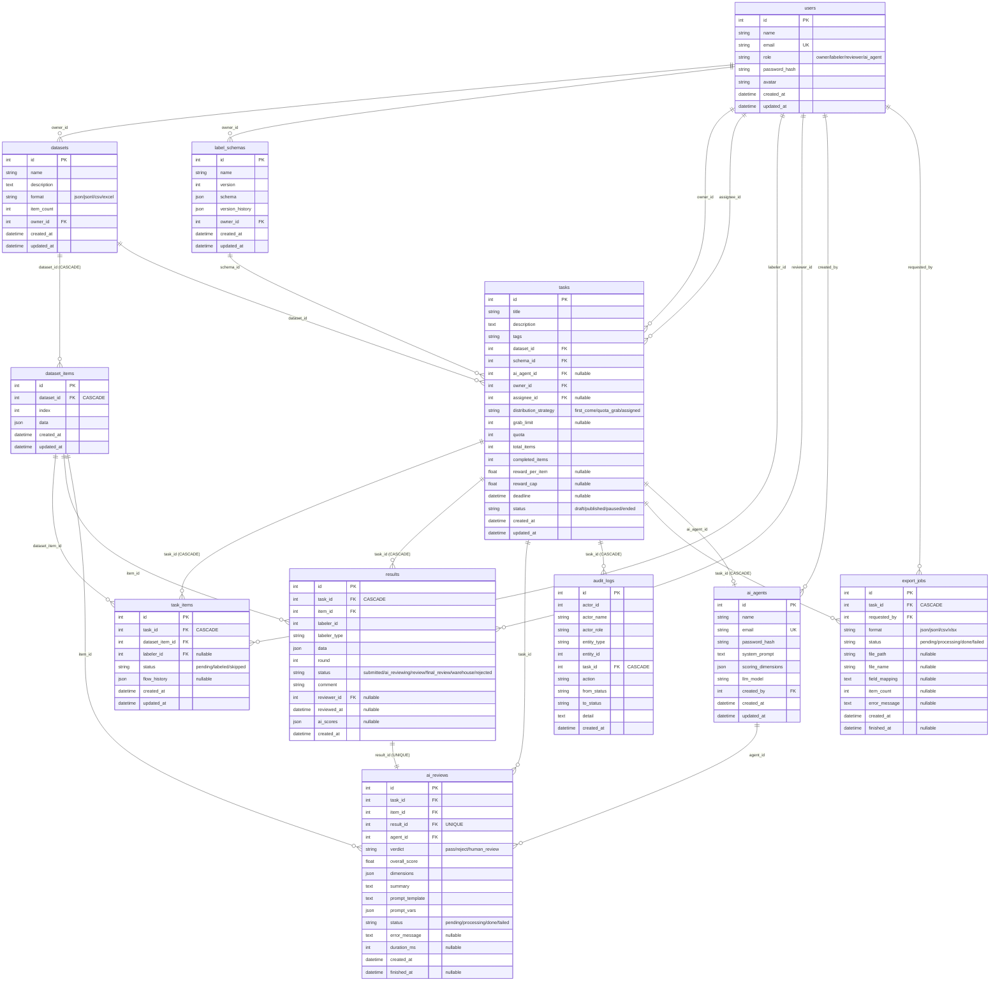

# LabelHub 数据库 ER 图



## 核心关系链

```
主线: User(owner) ──→ Dataset ──→ DatasetItem
                        │                │
                        ▼                ▼
User(owner) → LabelSchema    Task ──→ TaskItem ──→ LabelResult ──1:1──→ AiReview ──→ AiAgent
                        │         │                │
                        │         ▼                ▼
                        │    User(labeler)    User(reviewer)
                        │
                        ├──→ AuditLog
                        └──→ ExportJob
```

## 关键索引

| 表 | 索引 |
|----|------|
| task_items | (task_id, labeler_id, status) |
| ai_reviews | (task_id), (agent_id) |
| tasks | (owner_id), (status) |
| ai_agents | (email) UNIQUE |
| ai_reviews | (result_id) UNIQUE |
