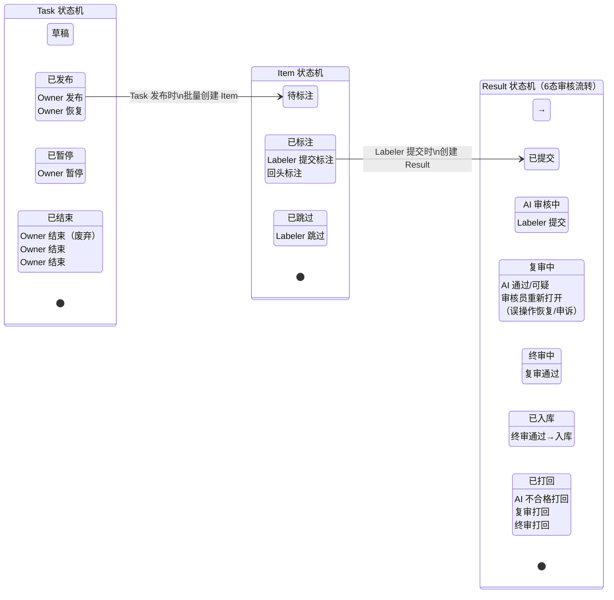

# LabelHub 状态机流转图

### 角色图例

| 颜色 | 角色 | 操作 |
|------|------|------|
| ■ 紫色 | Owner | 发布/暂停/恢复/结束任务 |
| ■ 蓝色 | Labeler | 认领/标注/提交/跳过 |
| ■ 紫色 | AI Agent | 自动预审评分 |
| ■ 黄色 | Reviewer | 复审/终审通过或打回 |
| ■ 红色 | — | 打回通道 |

### 关键规则

- **非法转移拒绝** — 所有状态迁移通过 `validate_transition()` 校验，不在合法表中的转移自动报错
- **审计日志** — 每次状态迁移自动写入 `audit_logs`，记录 actor + from_status → to_status + detail
- **VARCHAR 存储** — 枚举值存储在应用层 `state_machine/` 模块，数据库不设 ENUM
