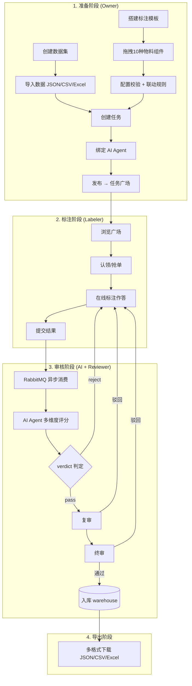

# LabelHub 端到端演示流程（课件）

## 工作流全景

```
建数据集 → 搭模板 → 建任务+发布 → 标注 → AI预审 → 审核 → 导出
```



## 三大技术亮点

| 亮点 | 含金量 | 为什么值得讲 |
|------|--------|------------|
| **动态表单架构** | Designer/Renderer 解耦 + Formily JSON Schema 驱动 + DnD 拖拽 | 大部分标注平台手写表单，我们做到了可视化搭建、产物标准化、设计运行同源渲染 |
| **状态机正确性** | 三级状态机 9 条转移通道 + validate_transition 校验 + audit_log 审计 | 企业级系统必须保证业务流转不出错，VARCHAR 存储比 ENUM 更灵活 |
| **AI Agent 工程化** | 线程池 + 长生命周期 + MQ 异步 + 热重载 + 失败重跑 | 不是简单调 API，是生产级的 Agent 池设计，每个 Agent 是独立角色用户 |

---

## 第一幕：动态表单架构（2 分钟）

### 场景 1：创建数据集 + 导入数据

> 先演示 Owner 创建数据集的过程。点击新建数据集，输入名称，选择格式。创建完成后进入详情，批量导入几条示例数据。支持 JSON、JSONL、CSV、Excel 四种格式。

### 场景 2：Schema 设计器 — 可视化搭建

> 这是核心模块。左侧物料面板有 10 种组件：单行文本、多行文本、单选、多选、下拉、日期、富文本、JSON 编辑器、LLM 交互、ShowItem。拖拽搭建的过程就是对表单的 WYSIWYG 编辑。
>
> 搭建产物是标准 JSON Schema，可以导出、版本管理、导入复用。关键设计：Designer 预览和 Labeler 运行态渲染共用同一套 Formily 引擎，一处搭建处处生效。

### 场景 3：创建 AI Agent + 任务绑定发布

> 配置一个 AI 审核 Agent，设置评分维度和权重。然后创建任务，绑定数据集 + Schema + Agent 三要素，选择分发策略，设置配额和奖励，发布上架。

---

## 第二幕：状态机流转（1.5 分钟）

### 场景 4：Labeler 标注 + 提交

> 切换 Labeler 账号，浏览任务广场，认领任务。进入三栏工作台：左侧条目队列、中间 Schema 动态表单、右侧统计。标注几条数据后提交。草稿自动保存，1 分钟定时刷新。

### 场景 5：状态机讲解 + Reviewer 审核

> 提交后进入三级状态机：Task(draft→published)、Item(pending→labeled)、Result(submitted→ai_reviewing→review→final_review→warehouse)。每次迁移 validate_transition 校验 + audit_log 记录。
>
> Reviewer 在审核中心查看 AI 分组侧栏，通过或驳回。驳回后 Labeler 看到驳回理由，修改重新提交，round+1。

---

## 第三幕：AI Agent 工程化（1 分钟）

### 场景 6：AI 预审监控

> AI 预审监控页查看实时审核结果：维度评分条形图、AI 评语、处理日志时间线。失败记录支持重跑。切换 Agent 管理页看池状态——容量、忙碌/空闲、排队数。
>
> 设计要点：线程池长生命周期零冷启动、配置热重载、MQ 异步解耦、MQ 不可用降级。

---

## 第四幕：数据闭环（30 秒）

### 场景 7：看板 + 导出

> 看板总览全局统计，导出支持四种格式，字段映射可配置，异步导出 OSS 签名链接下载。

---

## 演示时长

| 幕 | 内容 | 时长 |
|----|------|------|
| 1 | 数据集 + Schema + AI Agent + 任务发布 | 2 min |
| 2 | Labeler 标注 + Reviewer 审核 | 1.5 min |
| 3 | AI 预审 + Agent 池 | 1 min |
| 4 | 看板 + 导出 | 30s |
| **合计** | | **5 min** |
